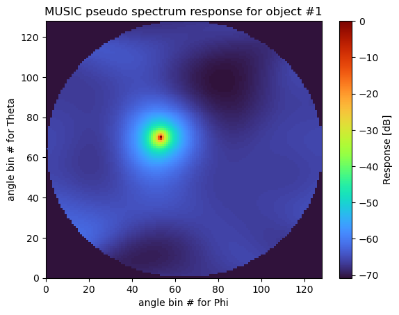

# 4DRadar-Simulation
***4DRadar-Simulation*** is Python implementation for synthesizing IF signals of FMCW MIMO Radar
(Frequency-Modulated-Continuous-Wave Multiple-Input-Multiple-Output Radar).

## Before you begin:
Before working through the notebooks, we recommend reviewing the following supplemental material if you are new to the theoretical background of Direction of Arrival (DoA) estimation for Uniform Linear Arrays (ULA):
* [Supplement: Theoretical Background of Direction of Arrival (DoA) Methods for ULA](./00_theoretical_background_of_doa.md)
  (Provides the fundamental theoretical derivations for common DoA methods, including Delay-and-Sum Beamforming (DSBF), FFT Beamforming (FFT-BF), and the high-resolution MUSIC algorithm, offering essential context for understanding how radar systems estimate the angles of incoming signals.)

This supplement is intended to provide foundational background, helping you understand the structure and objectives of each notebook more effectively.

## Beam pattern of ULA

This notebook evaluates beam pattern of uniform linear array (ULA).
see more detail for [01_beam_pattern](./Python/01_beam_pattern.ipynb).

## DoA of ULA

This notebook demonstrates DoA method of uniform linear array (ULA).
The FMCW-MIMO radar considered here operates in the 77 GHz frequency band.
see more detail for [02_8ula_single_object](Python/02_8ula_single_object.ipynb).

## DoA of URA

This notebook demonstrates DoA method of uniform rectangular array (URA).
The FMCW-MIMO radar considered here is same as ULA simulation.
see more detail for [03_16ura_single_object](Python/03_16ura_single_object.ipynb).
